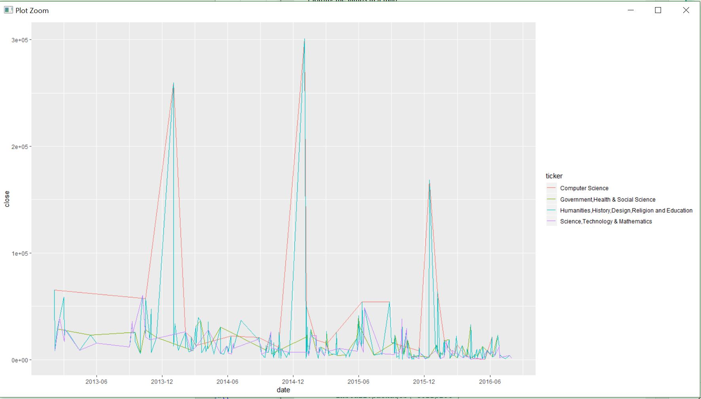
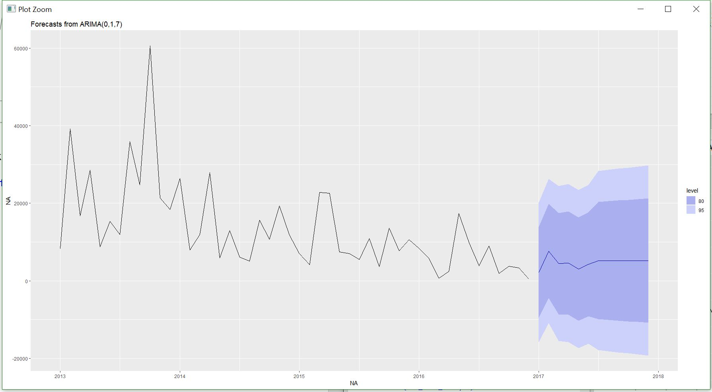

# Time Series analysis and forecasting MOOC
A Time-Series analysis for years 2012-2016 using R, including different Online Course Participants around the globe .
This stochastic time-series graph was obtained from a rich data of over 640K unique users.

It can be observed that "computer science" remained to be favorite among the participants throughout, and incredibly reached a peak of 300K in late 2014.

The figure above shows the prediction attained by participants in STEM courses for the following 12 months.
This prediction is achieved using ARIMA model in R, that predicts a slight rise of participants in early months of 2017.

# Citations
All thanks to HarvardX and MITx for the awesome data!

HarvardX, 2014, "HarvardX Person-Course Academic Year 2013 De-Identified dataset, version 3.0", https://doi.org/10.7910/DVN/26147, Harvard Dataverse, V11, UNF:6:WSoYmsP5KeX2t/6g2JiEuw== [fileUNF]

Chuang, Isaac and Ho, Andrew, HarvardX and MITx: Four Years of Open Online Courses -- Fall 2012-Summer 2016 (December 23, 2016). Available at SSRN: https://ssrn.com/abstract=2889436 or http://dx.doi.org/10.2139/ssrn.2889436
